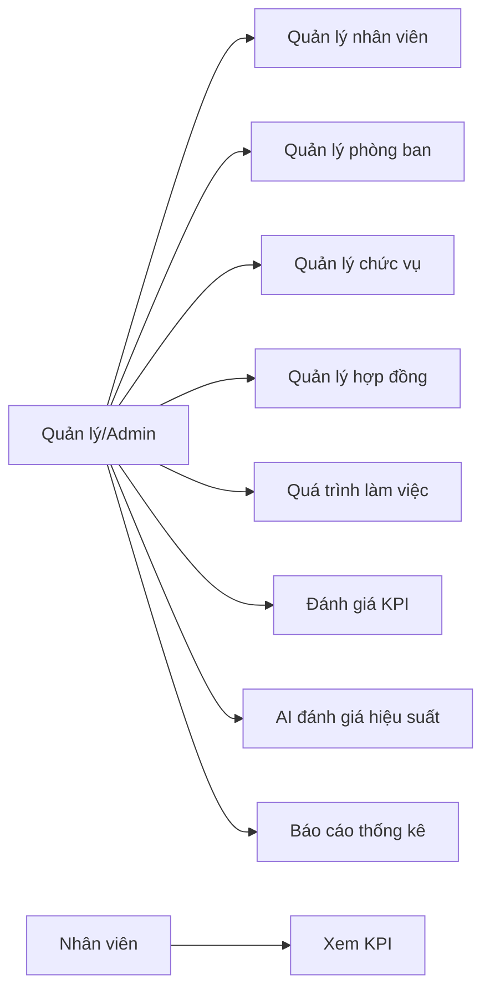
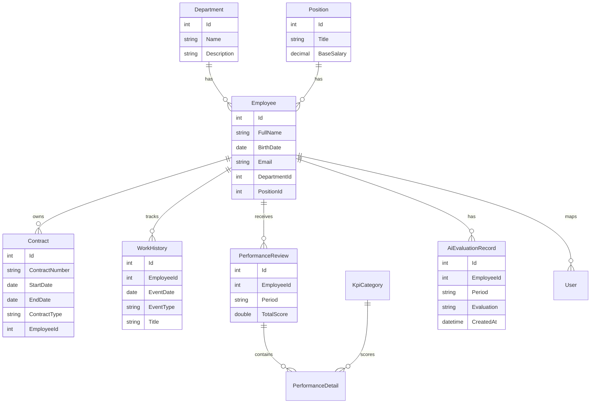
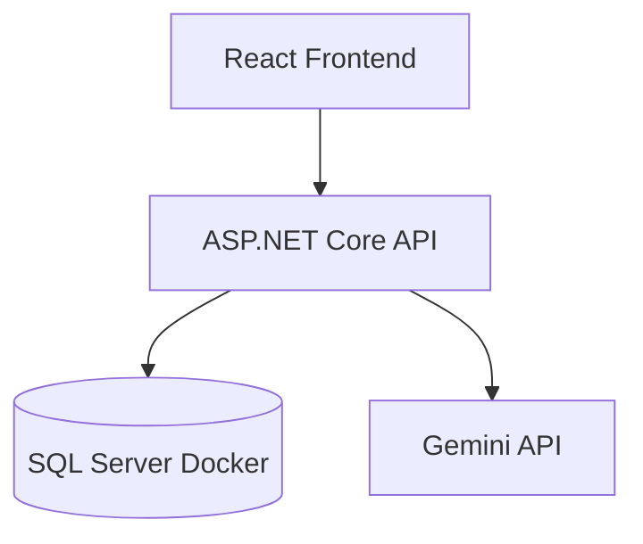

# Phân Tích Và Thiết Kế Hệ Thống HR Management

## Mục Tiêu

Hệ thống hỗ trợ quản lý nhân sự nội bộ gồm nhân viên, phòng ban, chức vụ, hợp đồng, quá trình làm việc, KPI và đánh giá hiệu suất bằng AI Gemini.

## Tác Nhân

- Admin: quản trị toàn hệ thống.
- Quản lý: quản lý nhân viên, phòng ban, chức vụ, hợp đồng, KPI, báo cáo và AI đánh giá.
- Nhân viên: xem thông tin và kết quả KPI liên quan.

## Chức Năng Chính

- Đăng nhập/đăng xuất và phân quyền theo vai trò.
- Quản lý nhân viên: danh sách, thêm, sửa, xóa qua API.
- Quản lý phòng ban.
- Quản lý chức vụ và lương cơ bản.
- Quản lý hợp đồng lao động.
- Theo dõi quá trình làm việc: điều chuyển, thăng chức, khen thưởng, kỷ luật, đào tạo.
- Đánh giá KPI theo tiêu chí trọng số.
- AI Gemini tổng hợp dữ liệu HR để tạo nhận xét hiệu suất.
- Lưu lịch sử đánh giá AI.
- Báo cáo thống kê nhân sự, KPI, hợp đồng sắp hết hạn và nhân viên cần theo dõi.

## Use Case Tổng Quát

## ERD Rút Gọn

## Kiến Trúc

## Công Nghệ

- Frontend: React, TypeScript, Vite, Tailwind CSS.
- Backend: ASP.NET Core, Entity Framework Core.
- Database: SQL Server chạy qua Docker.
- AI: Gemini API, key lưu bằng .NET user-secrets hoặc biến môi trường.

## Kiểm Thử Chính

- Build frontend: `npm run build`.
- Build backend: `dotnet build`.
- Cập nhật CSDL: `dotnet ef database update`.
- Kiểm tra API: `/api/reports/summary`, `/api/positions`, `/api/ai/performance-evaluation/history`.
